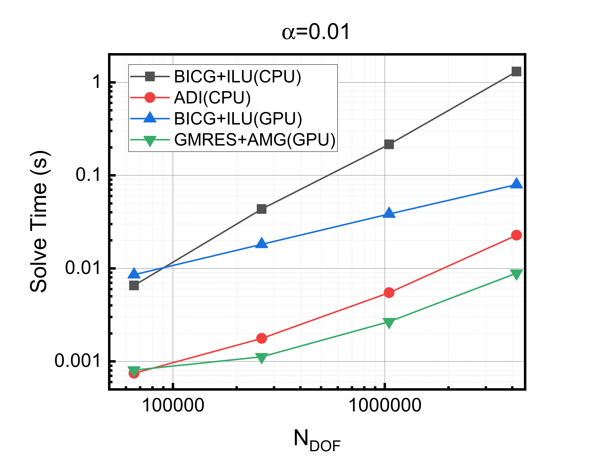
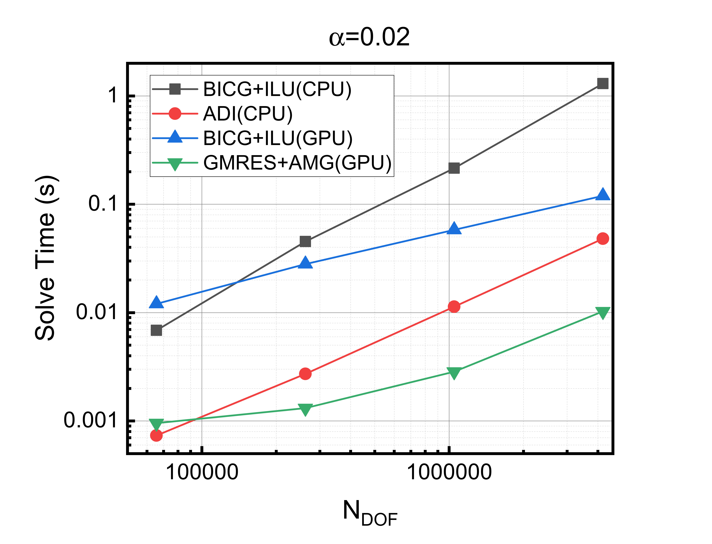
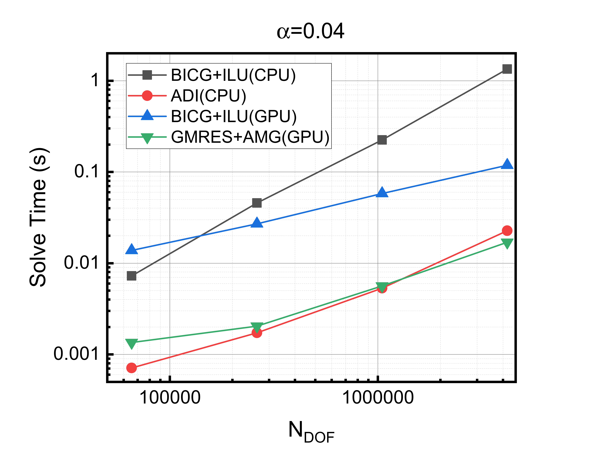
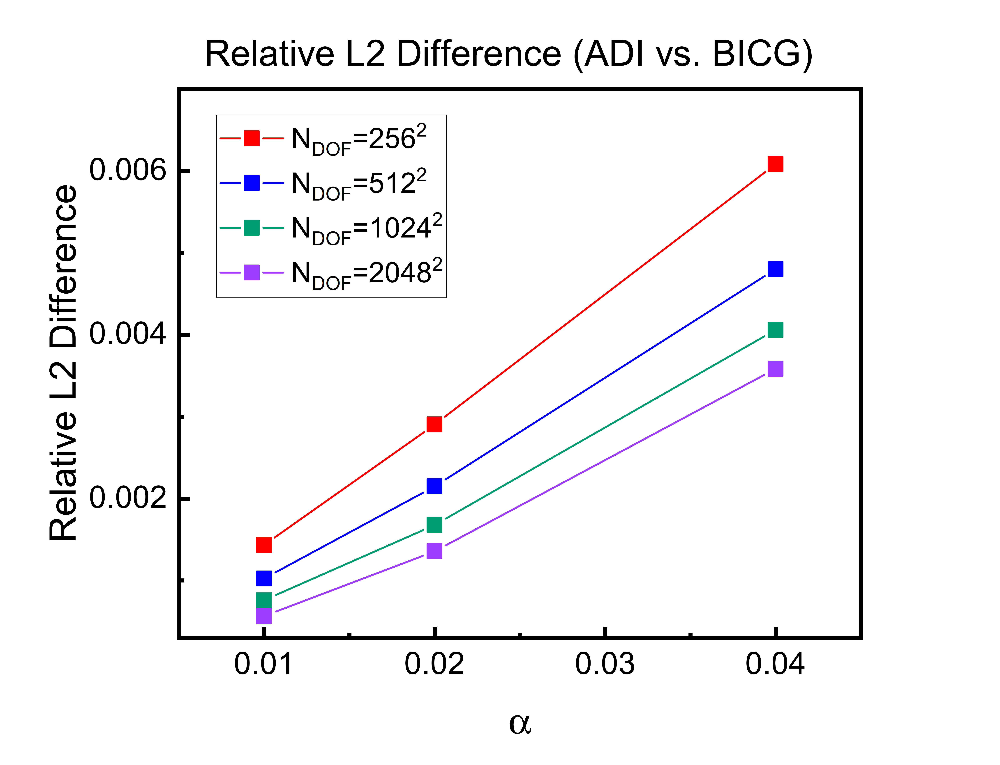

# ADI vs Krylov Solver Benchmarks

This respository provides a performance comparison of different numerical methods for solving elliptic PDEs of the form $(I - \alpha\nabla^2)m = f$, which frequently arise in projection-type methods with diffusion-like operators. As an example, such systems appear in Gauss–Seidel projection methods for the Landau–Lifshitz–Gilbert equation in micromagnetic simulations. The test problem is defined on a 2D square domain $\Omega_{\mathrm{c}}=[0,N]\times[0,N]$, and a defect in the center $\Omega_{\mathrm{d}}=[\frac{N-N_d}{2},\frac{N+N_d}{2}]\times[\frac{N-N_d}{2},\frac{N+N_d}{2}]$, where the value of $m$ is fixed. The PDE is solved in $\Omega_{\mathrm{c}}\setminus\Omega_{\mathrm{d}}$, with Neumann boundary condition applied. This PDE is solved via regular iterative solvers on both CPU and GPU, and an Alternating Direction Implicit (ADI) method that obtains a good approximate solution when $\alpha$ is small and is quite efficient compared to general solvers.

## Solver Methods

### 1. Alternating Direction Implicit (ADI)

The ADI method decomposes the 2D Laplacian operator using operator splitting (when $\alpha$ is small):

$$
A = (I - \alpha\nabla^2) = (I - \alpha(D_x^2+D_y^2))=(I-\alpha D_x^2)(I-\alpha D_y^2)+o(\alpha^2)=A_xA_y+o(\alpha^2)
$$

This allows the 2D problem to be solved as two sequential 1D tridiagonal systems using the Thomas algorithm, achieving $O(N)$ complexity. This is parallelized with OpenMP on CPU.

### 2. BiCGSTAB + ILU Preconditioning

Traditional iterative method with incomplete LU factorization. Implemented with Eigen and PETSc with CUDA. This method is more CPU friendly as ILU preconditioning requires sequential triangular solves.

### 3. GMRES + Algebraic Multigrid (AMG)

Krylov subspace method with multigrid preconditioning. Implemented with PETSc with CUDA. This method is more GPU friendly due to the efficiency of multigrid preconditioning on parallel architectures.

## Quick Start

### Prerequisites

**CPU:**

- GCC with C++17 support
- OpenMP
- [Eigen](https://eigen.tuxfamily.org/index.php?title=Main_Page) library (MPL 2.0 license)

**GPU:**

- [PETSc](https://petsc.org/release/install/) with CUDA support (BSD-2 license)
- [CUDA Toolkit](https://developer.nvidia.com/cuda-downloads) (required for PETSc GPU builds)
- [MPI](https://www.open-mpi.org/software/ompi/) (e.g., OpenMPI, required for PETSc)

> ℹ️ To learn how to install these dependencies, visit their official installation guides linked above.
>
> See `THIRD_PARTY_NOTICES.md` for third-party licenses and attributions.

### Building

```bash
cd src
# Edit src/cpu/compile_cpu.sh and src/gpu/compile_gpu.sh first to custom your environment variable
bash ./compile_all.sh
```

### Example Benchmarks

```bash
# Generate test data
cd src/f_vec
./generate_f 2048 512 2048_512_f.bin
./generate_f 1024 256 1024_256_f.bin
./generate_f 512 128 512_128_f.bin
./generate_f 256 64 256_64_f.bin

# Run CPU benchmarks
cd src/cpu
./run_cpu.sh > cpu_output

# Run GPU benchmarks  
cd src/gpu
# Edit run_gpu.sh first to custom your environment variable
./run_gpu.sh > gpu_output

# Collect and analyze results
python collect_cpu.py ./cpu_output --out_csv cpu_results.csv
python collect_gpu.py ./gpu_output --out_csv gpu_results.csv
```

## Performance Results

For demonstration, the solvers are benchmarked with 4 systems with sizes $N=2048,1024,512,256$, and with $N_{d}=N/4$. Each system has $N_{\mathrm{DOF}}=N^2$ degrees of freedom. The parameter $\alpha$ is set to be 0.01, 0.02, and 0.04. For each method, it is solved 10 times and average solve time is taken for stability. Finally the solver runtime is plotted against the number of degrees of freedom. All CPU benchmarks were performed on 32 CPU threads on Intel Gold 6248R CPU, and the PETSc programs with CUDA are on a single NVIDIA A100 GPU. In addition, the relative L2 differences $\frac{\lVert x_{\mathrm{ADI}} - x_{\mathrm{iterative}} \rVert_2}{\lVert x_{\mathrm{iterative}} \rVert_2}$
 for different $\alpha$ values are shown. Here are results:



*Figure 1: Solve time comparison for $\alpha=0.01$.*



*Figure 2: Solve time comparison for $\alpha=0.02$.*



*Figure 3: Solve time comparison for $\alpha=0.04$.*



*Figure 4: Relative L2 difference for different $N,\alpha$.*

### Key Observations

- **BiCGSTAB + ILU is less GPU-friendly**:
  ILU preconditioning relies on sequential triangular solves, which are well-suited to CPUs but inefficient on GPUs. Consequently, BiCGSTAB + ILU scales poorly on GPUs compared to GMRES + AMG.
- **ADI shows competitive performance**:
  ADI shows competitive performance: Across all tested system sizes, ADI achieves runtimes comparable to GMRES + AMG, highlighting its efficiency as a lightweight direct solver.
- **Error convergence of ADI**:
  The relative L2 difference decreases as $\alpha$ becomes small, confirming that ADI provides accurate approximations in this regime.

## Acknowledgments

The author thanks Professor Carlos J. García Cervera at UC Santa Barbara for suggesting the ADI algorithm.

## License

MIT License - Copyright (c) 2025 Hongyi Guan
See LICENSE file for full license text.

